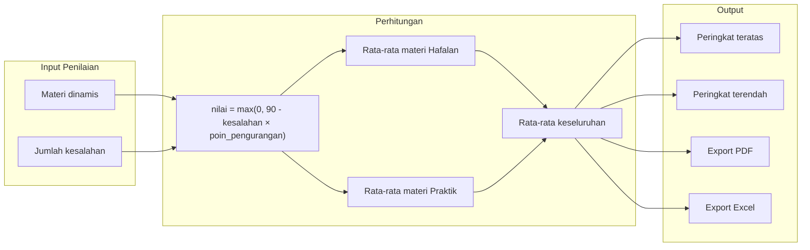
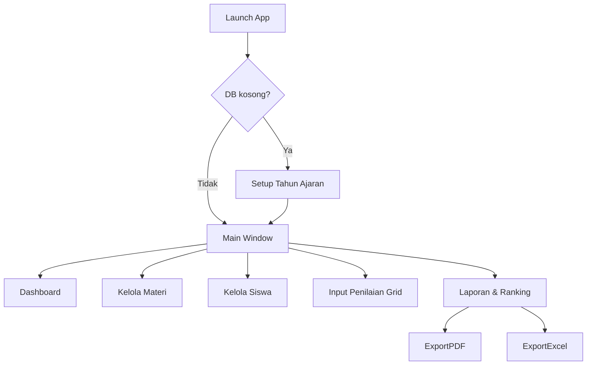

# Rencana Aplikasi Penilaian PIB MTs

> **Spesifikasi lengkap untuk Codex:** [`C:\Users\ilham\pib-penilaian-mts\SPEC.md`](C:\Users\ilham\pib-penilaian-mts\SPEC.md)

## Rekomendasi Teknologi

Catatan 2026-07-18: Kuota Figma free habis, jadi referensi frontend dipindahkan ke hasil Google Stitch lokal di
[`stitch_sistem_penilaian_praktik_ibadah`](stitch_sistem_penilaian_praktik_ibadah). Implementasi CustomTkinter
mengambil arah visual Stitch (sidebar tetap, header periode, kartu statistik, tabel padat), tetapi logika input tetap
mengikuti SPEC.md: guru mengisi jumlah kesalahan, bukan skor 0-100.

| Layer | Pilihan | Alasan |
|-------|---------|--------|
| Bahasa | **Python 3.11+** | Anda sudah familiar (lihat [ppdb-mts-latihan](C:\Users\ilham\ppdb-mts-latihan)); mudah dirawat dan diperluas |
| UI Desktop | **CustomTkinter** + **tksheet** | Tampilan modern di Windows; tksheet cocok untuk input nilai seperti spreadsheet |
| Database | **SQLite** (via `sqlite3` stdlib) | Aman untuk data lokal, tidak perlu server, akurat untuk relasi siswa–materi–nilai |
| Validasi | **Pydantic** | Mencegah input invalid sebelum disimpan |
| Export Excel | **openpyxl** | Standar de-facto, mudah format laporan |
| Export PDF | **fpdf2** | Ringan, cukup untuk laporan sekolah |

Proyek baru akan dibuat di folder **`C:\Users\ilham\pib-penilaian-mts`**, terpisah dari proyek latihan PPDB.

---

## Aturan Bisnis (Berdasarkan Jawaban Anda)



- **Skor per materi**: maksimal 90; setiap kesalahan mengurangi poin sesuai `poin_pengurangan` materi (bisa berbeda antar materi dan aspek hafalan/praktik).
- **Rata-rata hafalan**: rata-rata nilai semua materi ber-aspek `hafalan` untuk siswa tersebut.
- **Rata-rata praktik**: rata-rata nilai semua materi ber-aspek `praktik`.
- **Rata-rata total**: rata-rata dari (rata hafalan + rata praktik) / 2 — jika salah satu aspek belum dinilai, hanya aspek yang ada yang dihitung.
- **Organisasi data**: per **tahun ajaran**, **semester**, dan **kelas** (7A, 8B, dll).

---

## Struktur Proyek

```
pib-penilaian-mts/
├── main.py                  # Entry point aplikasi
├── config.py                # Konstanta (nilai maks 90, path DB, nama sekolah)
├── requirements.txt
├── README.md
├── data/
│   └── pib.db               # SQLite (auto-created)
├── models/
│   ├── siswa.py
│   ├── materi.py
│   ├── penilaian.py
│   └── periode.py           # tahun ajaran + semester + kelas
├── services/
│   ├── penilaian_service.py # Logika hitung nilai, rata-rata, ranking
│   ├── export_excel.py
│   └── export_pdf.py
├── database/
│   ├── connection.py        # Koneksi & migrasi schema
│   └── repository.py        # CRUD queries
├── ui/
│   ├── app.py               # Window utama + navigasi sidebar
│   ├── dashboard.py         # Ringkasan statistik
│   ├── siswa_view.py        # CRUD siswa per kelas
│   ├── materi_view.py       # CRUD materi (hafalan/praktik)
│   ├── penilaian_view.py    # Grid input kesalahan (tksheet)
│   ├── laporan_view.py      # Ranking + tombol export
│   └── components/          # Widget reusable (form dialog, tabel)
└── tests/
    └── test_penilaian.py    # Unit test formula & ranking (kritis untuk akurasi)
```

Pola ini konsisten dengan [ppdb-mts-latihan](C:\Users\ilham\ppdb-mts-latihan): `models/` → `services/` → `ui/`, sehingga mudah Anda pelajari dan kembangkan.

---

## Skema Database (SQLite)

```sql
-- Periode aktif
tahun_ajaran (id, nama, is_aktif)
semester     (id, tahun_ajaran_id, nama, is_aktif)  -- Ganjil/Genap

-- Organisasi siswa
kelas        (id, nama, tingkat)                     -- 7A, 8B, ...
siswa        (id, nis, nama, kelas_id, semester_id, is_aktif)

-- Materi dinamis per semester
materi       (id, semester_id, nama, aspek, poin_pengurangan, urutan, is_aktif)
             -- aspek: 'hafalan' | 'praktik'

-- Penilaian
penilaian    (id, siswa_id, materi_id, jumlah_kesalahan, nilai, updated_at)
             -- UNIQUE(siswa_id, materi_id)
             -- nilai dihitung ulang saat save, disimpan untuk audit
```

Indeks pada `(semester_id, kelas_id)` dan `(siswa_id, materi_id)` untuk performa query ranking.

---

## Modul & Fitur Utama

### 1. Setup Periode (first-run wizard)
- Input nama sekolah, tahun ajaran, semester aktif
- Buat kelas (bisa tambah/hapus)
- Pilih kelas aktif saat input penilaian

### 2. Kelola Materi (`materi_view.py`)
- Tambah/edit/nonaktifkan materi
- Field: nama materi, aspek (hafalan/praktik), poin pengurangan per kesalahan, urutan tampilan
- Materi terikat semester — saat semester baru, bisa **salin materi** dari semester sebelumnya

### 3. Kelola Siswa (`siswa_view.py`)
- CRUD siswa: NIS, nama, kelas
- Import massal dari Excel (opsional fase 2; struktur disiapkan di repository)
- Filter per kelas

### 4. Input Penilaian (`penilaian_view.py`) — fitur inti
- Tampilan grid: **baris = siswa**, **kolom = materi** (grouped: Hafalan | Praktik)
- Sel berisi jumlah kesalahan (integer ≥ 0)
- Preview nilai per sel: `90 - kesalahan × poin` (warna: hijau ≥80, kuning 60–79, merah <60)
- Simpan batch; validasi Pydantic sebelum commit
- Navigasi: pilih kelas → tampilkan grid

### 5. Dashboard & Laporan (`dashboard.py`, `laporan_view.py`)

**Statistik per kelas:**
| Kolom | Keterangan |
|-------|-----------|
| Peringkat | Urutan berdasarkan rata-rata total |
| NIS / Nama | Identitas siswa |
| Rata Hafalan | Rata-rata nilai materi hafalan |
| Rata Praktik | Rata-rata nilai materi praktik |
| Rata Total | Gabungan keduanya |
| Status | Lengkap / belum dinilai semua |

**Ranking:**
- **Top N** siswa terbaik (default 5, bisa diatur)
- **Bottom N** siswa perlu perhatian
- Filter per kelas atau seluruh semester

### 6. Export (`export_excel.py`, `export_pdf.py`)

**Excel** (openpyxl):
- Sheet 1: Rekap per siswa (NIS, nama, kelas, rata hafalan, rata praktik, rata total, peringkat)
- Sheet 2: Detail per materi (matriks siswa × materi + nilai)
- Header: nama sekolah, tahun ajaran, semester, kelas, tanggal export

**PDF** (fpdf2):
- Format laporan formal untuk arsip/rapat
- Tabel ranking + ringkasan statistik kelas (rata kelas, jumlah siswa dinilai)

File disimpan ke folder `exports/` dengan nama otomatis: `PIB_7A_2026-Ganjil_2026-07-18.xlsx`

---

## Logika Perhitungan (Inti Akurasi)

File [`services/penilaian_service.py`](services/penilaian_service.py):

```python
NILAI_MAKS = 90

def hitung_nilai(jumlah_kesalahan: int, poin_pengurangan: float) -> float:
    return max(0.0, NILAI_MAKS - jumlah_kesalahan * poin_pengurangan)

def rata_rata_aspek(nilai_per_materi: dict[str, float], aspek: str) -> float | None:
    filtered = [v for k, v in nilai_per_materi.items() if k.endswith(aspek)]
    return sum(filtered) / len(filtered) if filtered else None

def hitung_ranking(siswa_scores: list[dict]) -> list[dict]:
    # Sort descending by rata_total; tie-break by rata_hafalan then nama
    ...
```

Unit test di [`tests/test_penilaian.py`](tests/test_penilaian.py) akan cover:
- 0 kesalahan → 90
- Kesalahan berlebih → floor di 0
- Rata-rata dengan materi belum dinilai
- Ranking dengan nilai sama (tie-break)

---

## Alur UI (Navigasi)



Sidebar navigasi (CustomTkinter) dengan indikator periode aktif di header: `MTs Al-Hikmah | 2026/2027 Ganjil | Kelas 7A`.

---

## Dependencies (`requirements.txt`)

```
customtkinter>=5.2.0
tksheet>=7.0.0
openpyxl>=3.1.0
fpdf2>=2.7.0
pydantic>=2.0.0
```

Tidak ada dependency berat (Django, Electron, dll) — instalasi: `pip install -r requirements.txt`, jalankan: `python main.py`.

---

## Fase Implementasi

### Fase 1 — Foundation (core)
- Setup proyek, database schema, migrasi otomatis
- Models + repository CRUD
- Service perhitungan nilai + unit test
- Config & first-run wizard

### Fase 2 — Master Data UI
- Kelola tahun ajaran/semester/kelas
- CRUD siswa & materi
- Salin materi antar semester

### Fase 3 — Input Penilaian
- Grid tksheet per kelas
- Simpan & validasi batch
- Preview warna nilai

### Fase 4 — Laporan & Export
- Dashboard statistik
- Ranking top/bottom
- Export Excel & PDF

### Fase 5 — Polish
- README panduan penggunaan
- Backup/restore database (copy file `pib.db`)
- (Opsional) bundling `.exe` via PyInstaller

---

## Risiko & Mitigasi

| Risiko | Mitigasi |
|--------|----------|
| Input kesalahan invalid (angka negatif, teks) | Validasi Pydantic + batasi sel grid ke integer ≥ 0 |
| Materi diubah setelah penilaian | Nilai disimpan dengan snapshot `poin_pengurangan`; recalculate saat materi diubah dengan konfirmasi |
| Kehilangan data | SQLite file lokal; fitur backup manual + dokumentasi lokasi `data/pib.db` |
| UI lambat untuk kelas besar | Lazy load grid; batch save; indeks DB |

---

## Contoh Alur Penggunaan Harian

1. Buka app → pilih semester & kelas 7A
2. Tab **Materi** → tambah "Doa makan" (hafalan, -2 poin), "Sholat berjamaah" (praktik, -3 poin)
3. Tab **Siswa** → tambah 30 siswa kelas 7A
4. Tab **Penilaian** → isi jumlah kesalahan di grid → Simpan
5. Tab **Laporan** → lihat ranking → Export PDF untuk rapat guru
